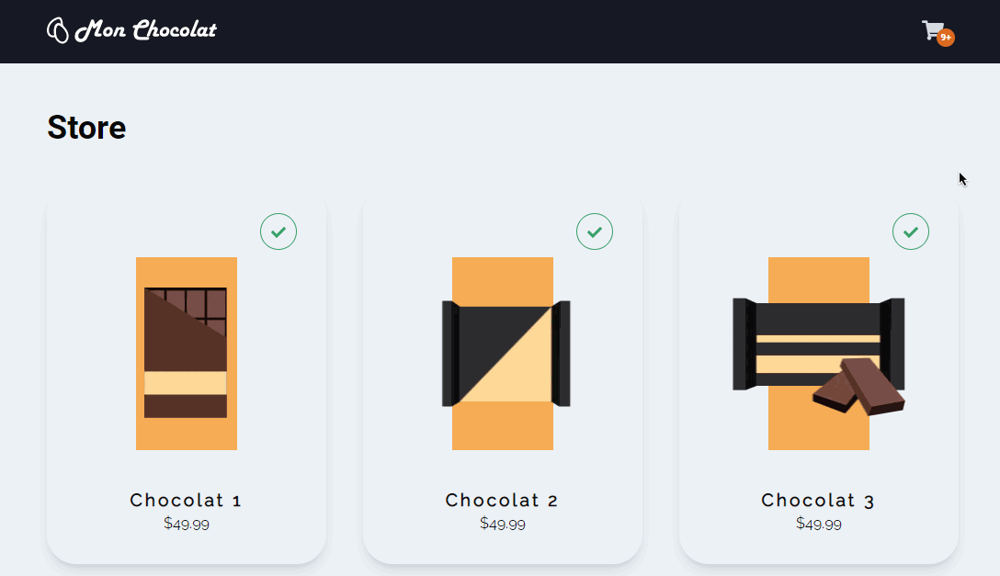

<h1 align="center">
	
</h1>

<p align="center">
 
</p>

<p align="center">Mon chocolat is a personal project that implements the e-commerce cart functionality using Redux. <a href="https://mon-chocolat-juniorr452.vercel.app/" rel="noopener noreferrer">Check out the live demo here</a>.

## About  

<p align="center">
  
</p>

Mon chocolat was made to put my Redux and testing skills in practice. The goal was to implement a 2-page web app that allowed the user to add products to cart and review his order on checkout.

I made use of MirageJS to mock http requests and make development, testing and deploying the live demo easier. That way, I would not need to create a separate server and database to store data. For details on what endpoints are mocked, you can check the server.js or its test file. 

I feel this project helped me refine my understading in Redux and testing pages, components and business logic, allowing to make more maintainable apps and giving an extra layer security to develop new functionalities.

## Technologies used

* NextJS
* Redux
* Chakra-UI
* Figma Motion
* MirageJS
* React Query
* Cypress
* Jest
* Typescript

## Run

Just clone this project and run the following commands:

```
yarn

yarn dev
```

Then open [http://localhost:3000](http://localhost:3000) in your browser to see the website.